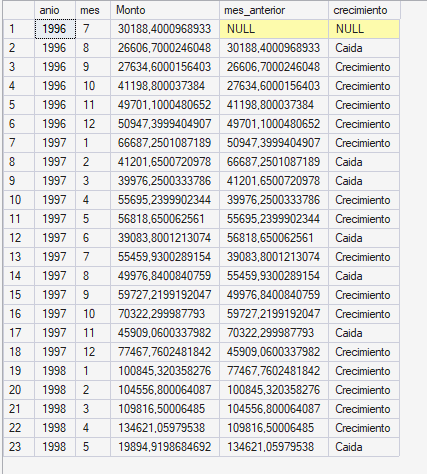

# Semana 3 — CASE WHEN y Series Temporales

## Ejercicios de esta semana

### 01 — Segmentación de clientes
Clasificación de clientes en VIP, Regular y Ocasional según monto total gastado.
**Herramienta:** CASE WHEN

### 02 — Crecimiento mensual
Clasificación de cada mes como Crecimiento, Caída o Igual comparando con el mes anterior.
**Herramientas:** LAG + CASE WHEN

**Hallazgo:** 15 meses de crecimiento y 7 de caída. Agosto muestra caída en ambos años disponibles pero el dataset 
es insuficiente para confirmar estacionalidad.

